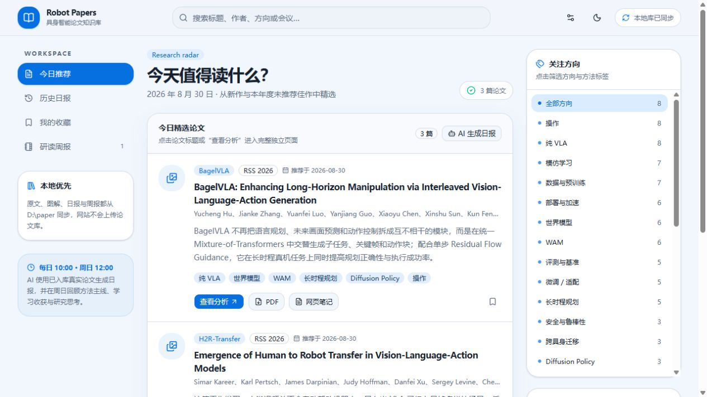
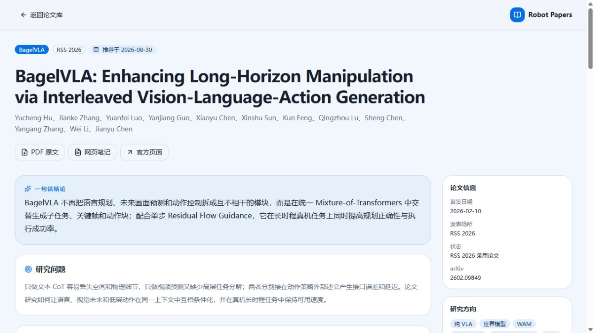

# Robot Papers

[](https://github.com/zzw-rgb/robot-papers/releases/latest)
[](https://github.com/zzw-rgb/robot-papers/releases/latest)
[](LICENSE)

Robot Papers 是一个本地优先的具身智能论文阅读与整理工具，提供 Web 界面和 Windows Electron 桌面版。它从本地论文库生成可检索的阅读工作台，支持按推荐日期、研究方向和方法筛选论文，并展示论文图解、优点、局限性和后续研究机会。

## 下载

[下载最新版 Windows 安装包](https://github.com/zzw-rgb/robot-papers/releases/latest/download/Robot-Papers-Setup.exe)

安装后可在引导页选择论文库目录；默认使用 `D:\paper`。新设备的日报、周报和 Codex 联动配置见 [新设备配置指南](docs/NEW_DEVICE_SETUP.md)。

## 界面预览

### 论文工作台



### 论文分析页



## 功能

- 今日论文、历史日报、研读周报和本地收藏
- VLA、VLA + RL、模仿学习、世界模型、WAM、微调、跨具身迁移等多标签分类
- Markdown 论文详情页与顺序图解
- 图片原地放大，不跳离分析页面
- 中文全文检索、方向筛选和深色模式
- 本地 PDF、Obsidian 笔记和图片资源管理
- Codex 定时任务联动，默认不需要 OpenAI API Key
- Windows Electron 桌面应用和安装包构建

## 隐私与数据

Robot Papers 默认读取本机论文库，不会把论文目录上传到远程服务器。默认目录结构为：

```text
D:\paper
├─ 原文\YYYY-MM-DD\ShortName.pdf
└─ obsidian
   ├─ YYYY-MM-DD\ShortName.md
   ├─ 日报\YYYY-MM-DD.md
   └─ 研读周报\YYYY-MM-DD_to_YYYY-MM-DD.md
```

论文 PDF、论文图片、个人笔记、日报、周报、运行日志、API Key 和生成后的 `public/data`、`public/library` 均不会提交到 Git 仓库。

## 开发环境

- Windows 10/11（桌面版）
- Node.js 22.13 或更高版本
- pnpm

```powershell
pnpm install
pnpm dev
```

默认访问 <http://localhost:3000>。如需使用其他论文库：

```powershell
$env:ROBOT_PAPERS_ROOT = 'E:\MyPapers'
pnpm dev
```

## 同步论文库

```powershell
pnpm sync
```

同步脚本扫描本地 Obsidian 笔记，生成供界面读取的本地索引。第一次运行时，如果目录不存在，会自动创建基础目录。

## Electron 桌面版

```powershell
pnpm build:electron
pnpm electron:dev
```

生成便携式桌面应用：

```powershell
pnpm electron:package
```

生成 Windows 安装包：

```powershell
pnpm electron:installer
```

构建产物保存在 `release`，不会提交到源码仓库。详细使用说明见 [README-桌面版.md](README-桌面版.md)。

## Codex 定时任务联动

推荐使用 Codex 本地定时任务负责检索、下载和分析论文，Robot Papers 负责读取和展示生成的本地文件。这种模式不调用 OpenAI API。

- 具身智能论文日报：每天 10:00
- 具身智能研读周报：每周日 12:00

新设备的完整配置流程和可复制提示词见 [docs/NEW_DEVICE_SETUP.md](docs/NEW_DEVICE_SETUP.md)。

## 项目结构

```text
app/            页面入口
components/     界面与论文详情组件
electron/       Electron 主进程和本地文件协议
scripts/        论文库同步、打包和安装脚本
lib/            类型与数据读取逻辑
assets/         应用图标
```

## 安全

请不要在 Issue、日志或提交记录中粘贴 API Key、私人论文笔记或未公开论文。安全问题请按照 [SECURITY.md](SECURITY.md) 说明处理。

## 许可证

[MIT License](LICENSE)
